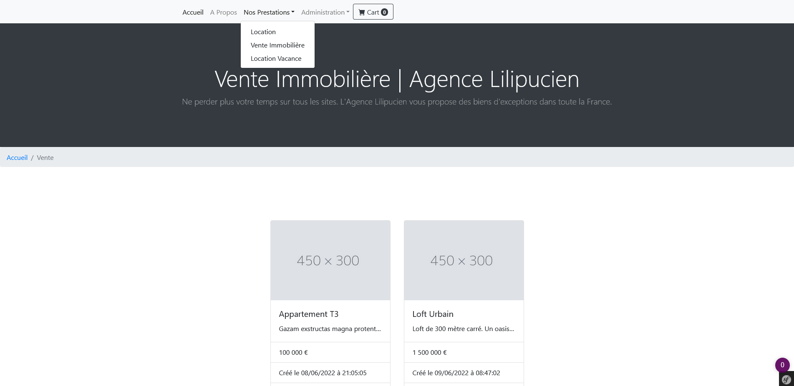
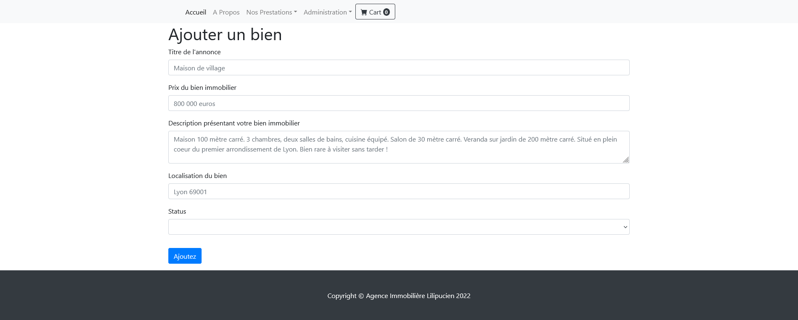
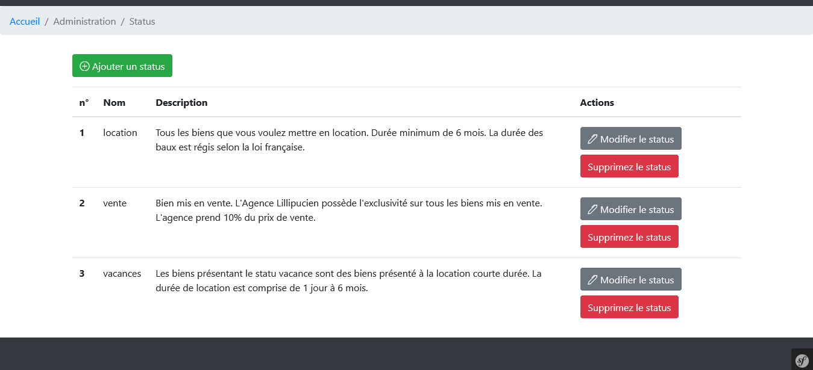

<div id="top"></div>

<div align="center">
  <h1> Lilipucien - Agency </h1>
  <p>Web Application with famous framework Symfony</p>
</div>

***

### Table of Content
1. [General Info](#general-info)
3. [Visual](#visual)
4. [Technologies](#technologies)
5. [Installation](#installation)
6. [Road Map](#roadmap)
7. [Contributing](#contributing)
8. [Contact](#contact)
<p align="right">(<a href="#top">back to top</a>)</p>

***

### General Info
Realization of a complete web application with framework Symfony. 
website of a real estate agency with backoffice adminisstration.
<p align="right">(<a href="#top">back to top</a>)</p>

***

### Visual
Here is an overview of project. </br>

<p align="right">(<a href="#top">back to top</a>)</p>

<p align="right">(<a href="#top">back to top</a>)</p>

<p align="right">(<a href="#top">back to top</a>)</p>

***

### Technologies
- HTML 5
- CSS 3
- Javascript
- sql
- PHP
- Symfony
- Twig
- Bootstrap
<p align="right">(<a href="#top">back to top</a>)</p>

***

### Installation

1. Clone the project
```
git clone https://github.com/LiseRochat/Registration-Login
```
2. Switch on your local server 
3. In your terminal :
    - cd your folder
    - composer install 
    - symfony console doctrine:database:create
    - symfony console make:migration
    - symfony console doctrine:migrations:migrate
    - symfony server:start
4. Don't forget to configure your .env.local with your access
<p align="right">(<a href="#top">back to top</a>)</p> <br>

***

### Contributing
If you have a suggestion that would make this better, please fork the repository and create a pull request. You can also simply open an issue with the tag "enhancement".

Don't forget to give the project a star! Thanks again!

1. Fork the Project
2. Create your Feature Branch (`git checkout -b feature/AmazingFeature`)
3. Commit your Changes (`git commit -m 'Add some AmazingFeature'`)
4. Push to the Branch (`git push origin feature/AmazingFeature`)
5. Open a Pull Request
<p align="right">(<a href="#top">back to top</a>)</p>

***

### Contact 
Rochat Lise - liserochat@live.fr </br>
Project Link: [https://github.com/LiseRochat/Lilipucien-Agency](https://github.com/LiseRochat/Lilipucien-Agency)
<p align="right">(<a href="#top">back to top</a>)</p>


